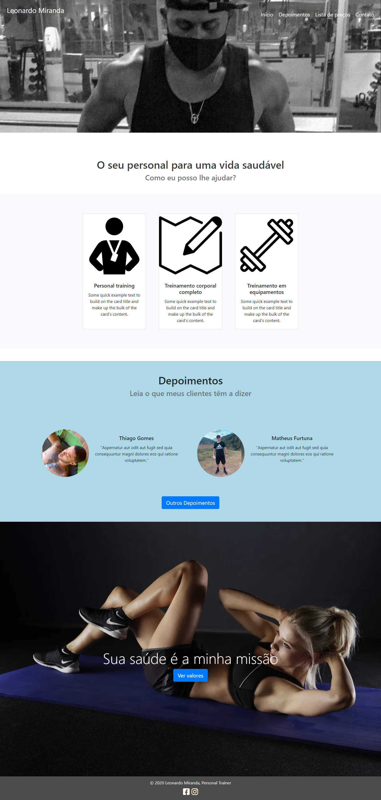

## Introdução

[Projeto Leonardo Personal](https://leonardo-personal.vercel.app/)

Este readme está dividido em:

- Introdução
- Descrição
- Funcionalidades
- Como instalar
- Imagem

## Descrição

Trata-se de um site para divulgar o trabalho de um personal trainer desenvolvido com Bootstrap 4 para fins didáticos.

## Funcionalidades

Na página 'início' temos o menu com o efeito 'hero image'. Logo abaixo temos cards alinhados com Grid, com os serviços fornecidos pelo personal trainer. Também temos uma área de depoimentos com cards arredondados, seguido de uma imagem com um botão para redirecionar para a página de valores. Por fim temos botões de redes sociais no rodapé da página utilizando os plugins "font-awesome" e "social buttons for bootstrap".

O menu ativa um efeito de sublinhado ao passar o mouse pelas opções.

No menu de 'depoimentos' temos 4 cards arredondados com depoimentos de clientes.

No menu 'lista de preços' temos uma tabela com quantidade de aulas por semana com respectivo valor. Ao passar o mouse pela tabela, é acionado um efeito de hover.

No menu 'contato' temos um iframe do Google Maps com a localização do personal trainer, seguidos de alguns dados como telefone e redes sociais.

No rodapé de todas as páginas temos o nome do personal seguidos de 2 botões que encaminham para as redes sociais.

## Como instalar

Para instalar, basta baixar ou clonar o projeto e abrir o arquivo "index.html" em seu navegador favorito.
Porém, você também pode acessar o site do projeto [clicando aqui](https://leonardo-personal.vercel.app/index.html)

## Imagem do Projeto

